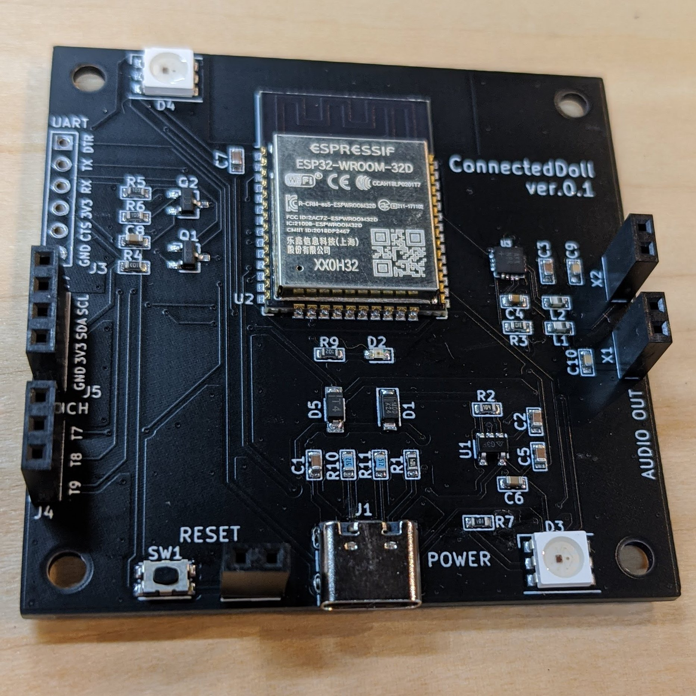
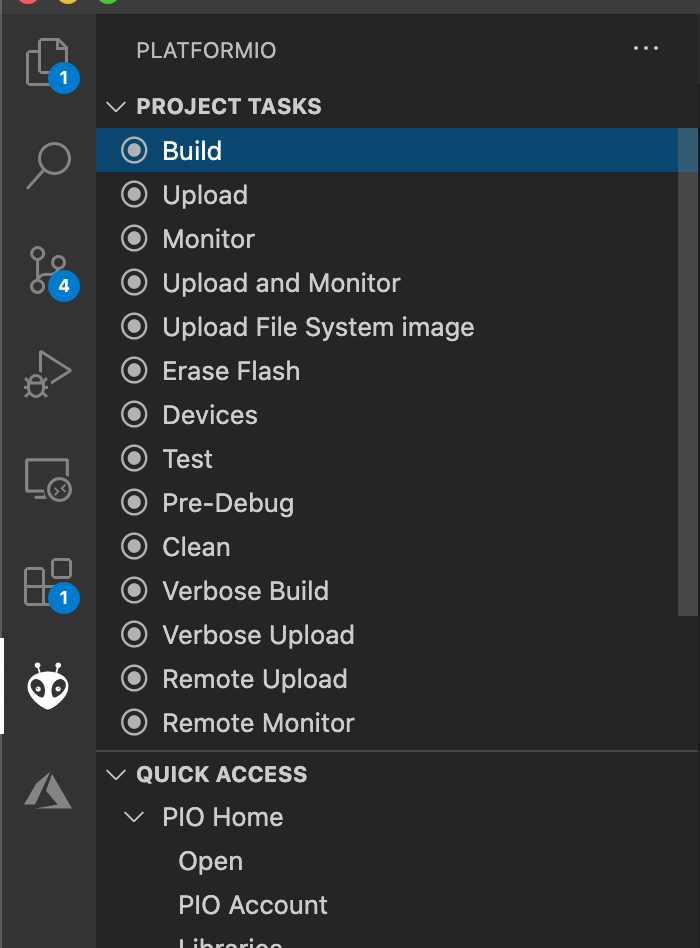

# ConnectedDoll ハードウェア

# 概要
ねんどろいど等10cmドールしたに置いてインターネット上にある音声データを再生する装置。  
タッチ操作での反応やフルカラーLEDでの通知にも対応。
初期ファームは 映像や音楽で使われている OSC(Open Sound Control)対応  
TouchDesigner や OSC 対応 Androidアプリ等から操作できます。

ESP32 for Arduino互換ボード なので 独自ファームの開発も可能で、スマホアプリ連動やスマートスピーカー連動やSlack連動等拡張にも対応できます。


# 環境

## ハードウェア構成　
[ConnectedDoll/pcb](https://github.com/ConnectedDoll/pcb)



## 基板 や 部品
- [FTDI USBシリアル変換アダプター Rev.2](https://www.switch-science.com/catalog/2782/)
- [PCB](https://github.com/ConnectedDoll/pcb)

# 開発環境
- [Visual Studio Code](https://marketplace.visualstudio.com/)  
- [PlatformIO IDE for VSCode](https://platformio.org/platformio-ide)  
[セットアップ手順](https://platformio.org/install/ide?install=vscode)

# ソフトウェア構成　
利用ライブラリやクラウド環境
- [Arduino core for the ESP32](https://github.com/espressif/arduino-esp32)
- [Adafruit_NeoPixel](https://github.com/adafruit/Adafruit_NeoPixel)
- [ESP8266Audio](https://github.com/earlephilhower/ESP8266Audio)
- [WiFiManager](https://github.com/zhouhan0126/WIFIMANAGER-ESP32)

- [ArduinoOSC](https://github.com/hideakitai/ArduinoOSC)


# ビルド手順

## 必要ライブラリ 取得
```
git clone git@github.com:ConnectedDoll/firmware.git
cd firmware/lib
git clone git@github.com:adafruit/Adafruit_NeoPixel.git
git clone git@github.com:earlephilhower/ESP8266Audio.git
git clone git@github.com:hideakitai/ArduinoOSC.git
git clone git@github.com:tzapu/WiFiManager.git

cd ..
code .
```
## ビルド & 書き込み
`USBシリアル変換アダプター` と `ConnectedDoll基板` を接続して `PlatformIO IDE` メニューから書き込む
  
- Build  
ビルドする
- Upload  
Buildした ファームを書き込む
- Upload File System image  
SPIFFS 領域に `data` フォルダ内容を書き込む 

# WiFi 設定
初回起動時のみ `ConnectedDoll` で アクセスポイントととして SSID が WiFi 接続待ち状態となる。  
インターネット接続可能なルータ等の SSID,パスワードを設定し完了すると OSC 操作可能なモードに移行される  
  

# OSC コマンド
OSC対応アプリから各制御する場合の参考  

## IPアドレス と ポート
|項目|備考|
|:--:|:--:|
|IPアドレス| シリアルに出力される |
|ポート| 54345 |

## WiFi等をリセット

```
/status/reset
例) /status/reset
```

## SPIFFS DIR

```
/status/dir
例) /status/dir
```

## ファイル再生

```
/status/play [path]
例) SPIFFS の sound.mp3 ファイル再生  
/status/play "/sound.mp3"

例) SPIFFS の sound.wav ファイル再生  
/status/play "/sound.wav"

例) [対応予定] URL 指定 mp3ファイル再生
/status/play "https://file-examples-com.github.io/uploads/2017/11/file_example_MP3_700KB.mp3"
```

## ボリューム変更

```
/status/volume [volume(0.0 - 1.0f)]
例) /status/volume 0.3f
```

## LED 色設定

```
/status/color [LED0("r,g,b")] [LED1("r,g,b")] [LED2("r,g,b")] [LED3("r,g,b")]
例) 
/status/color "255,255,0" "255,255,0" "255,255,0" "255,255,0"
```

## OSC 送信サンプル
node.js 製 OSC コマンド送信 サンプル

```
cd examples/node
npm install
npm run start 192.168.86.44

npm run start [送信先IP]
```

```
"use strict"


const send_host = process.argv[2];
const send_port = 54345;

console.log("send_host:port " + send_host + ":" + send_port);

const osc = require('node-osc');
function send() {
    client_send.send('/status/dir');
    console.log('/status/dir');

    client_send.send('/status/volume', 0.3);
    console.log('/status/volume');

    // client_send.send('/status/play', "/sound.mp3");
    // console.log('/status/play');
    
    // client_send.send('/status/play', "/sound.wav");
    // console.log('/status/play');

    // client_send.send('/status/play', "https://file-examples-com.github.io/uploads/2017/11/file_example_MP3_700KB.mp3");

    client_send.send('/status/color', "255,0,0", "0,0,255", "0,255,0", "255,0,255");
    console.log('/status/color');

    setTimeout( function() {
        client_send.send('/status/color', "0,0,0", "0,0,0", "0,0,0", "0,0,0");
        console.log('/status/color');    
    },1000);
}

setInterval(send, 5000);
```